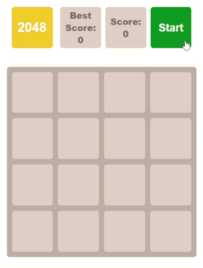

# 🎮 2048 Game

A classic 2048 game built from scratch with vanilla JavaScript, without any frameworks or libraries.

## ▶️ Demo

[Play online](https://yuliia-nudyk.github.io/2048-game/)



## 📝 Description

The game implements the classic 2048 mechanics: moving tiles around a 4×4 board using arrow keys, merging tiles with the same value, tracking the score, and saving the best score between sessions.

### Features

- Arrow key controls (↑ ↓ ← →)
- Merging tiles with the same value, with a smooth merge animation
- Current score tracking and best score persistence via localStorage
- A win message when a tile reaches 2048 (the game can still be continued afterwards)
- A lose message when no more moves are available
- Start / Restart button

## 🛠 Technologies

- HTML5
- SCSS (Sass)
- JavaScript (Vanilla JS, ES6+)
- Parcel — zero-config bundler

## 🚀 Running locally

1. Clone the repository:
```bash
git clone https://github.com/yuliia-nudyk/2048-game.git
```

2. Navigate to the project folder:
```bash
cd 2048-game
```

3. Install dependencies:
```bash
npm install
```

or

```bash
yarn install
```

4. Run the project locally:
```bash
npm start
```

or

```bash
yarn start
```

This will launch the project via Parcel, which automatically compiles SCSS to CSS and serves the app with hot reload.

## 🕹 Controls

| Key | Action |
|---|---|
| `↑` | Move tiles up |
| `↓` | Move tiles down |
| `←` | Move tiles left |
| `→` | Move tiles right |

## 📂 Project structure
```
├── src/
│   ├── images/
│   ├── styles/
│   │   └── main.scss
│   └── scripts/
│       └── main.js
├── index.html
└── README.md
```